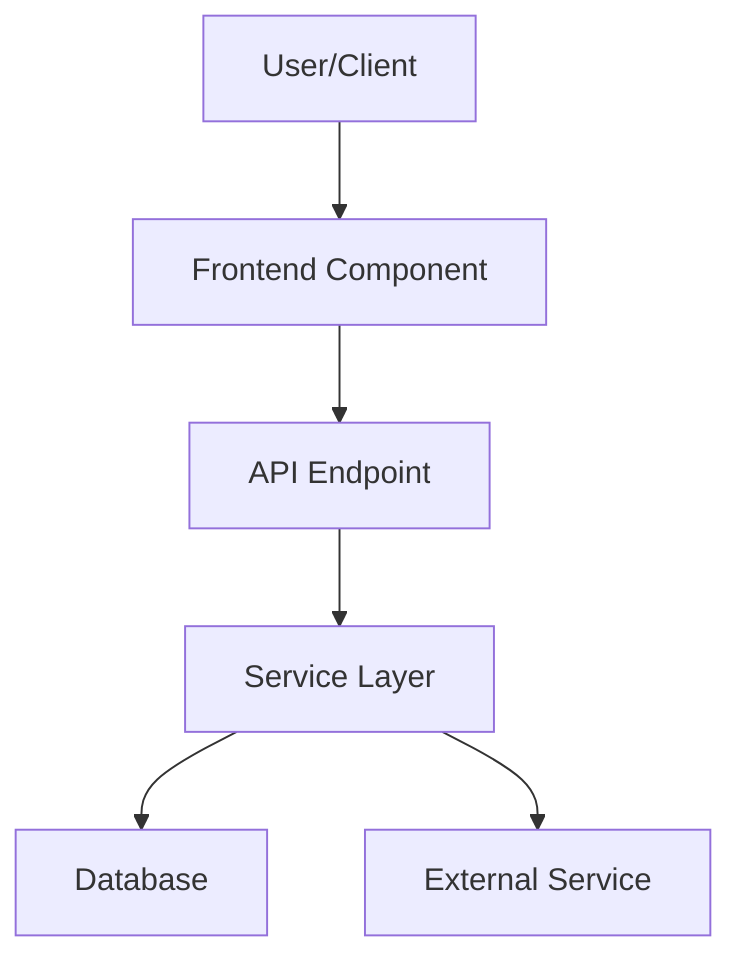
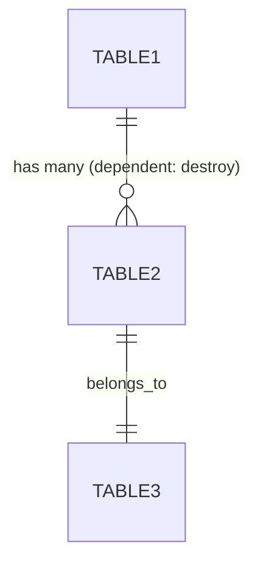

# [Feature Name]

> **Status**: ✅ Active | ⚠️ Beta | ⚠️ Planned / Routes Only | 🚫 Deprecated
> **Generated**: [YYYY-MM-DDTHH:MM:SSZ]
> **Last Updated**: [YYYY-MM-DDTHH:MM:SSZ]
> **Skutally Version:** Rails 8.1.0 / Ruby 4.0.1

---

## Feature Documentation Standards

### Purpose
Feature documentation is FOR human developers and users. It provides:
- Clear understanding of what the feature does
- How to use the feature
- Technical implementation details
- Configuration requirements
- Troubleshooting guidance

### Content Requirements

#### Must Include (use template):
1. **Overview**: What the feature does, why it exists
2. **Architecture**: How it's built (with diagrams for complex features)
3. **Model Details**: Associations, concerns, callbacks, state machines — ALL of them
4. **API Endpoints**: All endpoints verified against routes AND controller actions
5. **Database Schema**: Tables from `db/schema.rb` — ALL columns, not a subset
6. **Configuration**: Environment variables, settings
7. **Usage Examples**: Verbatim code from the codebase (never simplified)
8. **Authorization**: ALL policy methods, not just the main ones
9. **Testing**: Test files, coverage, key test cases
10. **Known Issues / Caveats**: Dead code, no-ops, bugs, hardcoded values
11. **Troubleshooting**: Common issues and solutions
12. **Related Features**: Links to related documentation

### Critical Rules — What NOT To Do
- **NEVER simplify code snippets** — copy verbatim from source, or don't include them
- **NEVER fabricate method names** — if you can't find it, don't document it
- **NEVER list a route without verifying the controller action exists**
- **NEVER omit model concerns** — list ALL `include` statements (Assignable, Trackable, Payable, Shippable, Contactable, etc.)
- **NEVER mark a feature "Active" unless controller + views + routes all exist**
- **NEVER omit `dependent:` options on associations** — they affect destroy behavior
- **NEVER list partial schema columns** — read `db/schema.rb` and list ALL columns for each table

---

## Overview

### What It Does
[One paragraph explaining the feature's purpose and main functionality]

### Why It Exists
[Business justification or user need this addresses]

### Key Capabilities
- [Capability 1]
- [Capability 2]
- [Capability 3]

---

## Architecture

### High-Level Design


### Components

#### Backend Components
| Component | File Path | Purpose |
|-----------|-----------|---------|
| [Component Name] | `app/path/to/file.rb` | [Purpose] |

> **Checklist**: Have you included ALL of these?
> - [ ] Controllers (including nested/namespaced)
> - [ ] Models (including STI subclasses)
> - [ ] Model concerns (`include` statements — Assignable, Trackable, Payable, Shippable, Contactable, Receivable, etc.)
> - [ ] Services (`app/services/`)
> - [ ] Workers/Jobs (`lib/workers/`)
> - [ ] Policies (`app/policies/`)
> - [ ] Search classes (`app/searches/`)
> - [ ] Broadcasters (`app/broadcasters/`)
> - [ ] ViewComponents (`app/components/`)
> - [ ] Form objects (`app/models/*_form.rb`)
> - [ ] Liquid drops (`app/drops/`)

#### Frontend Components
| Component | File Path | Purpose |
|-----------|-----------|---------|
| [Component Name] | `app/javascript/path/to/file.js` | [Purpose] |

### Technology Stack
- **Backend**: [Extracted from code]
- **Frontend**: [Extracted from code]
- **Database**: [Extracted from models]
- **External Services**: [If any]

---

## Model Details

### [ModelName]

#### Associations
List ALL associations with their options:
```ruby
# Copy verbatim from model file — include dependent:, optional:, class_name:, etc.
belongs_to :account
has_many :line_items, dependent: :destroy
has_one :balance_ledger, dependent: :destroy
```

#### Concerns
List ALL included concerns and what they provide:
| Concern | Purpose |
|---------|---------|
| `Assignable` | Adds `assign!`, `unassign!`, assignee delegation |
| `Trackable` | Adds activity tracking via PublicActivity |

#### Callbacks
List ALL callbacks in execution order:
| Callback | Method | Purpose |
|----------|--------|---------|
| `before_validation` | `:method_name` | [What it does] |
| `before_save` | `:method_name` | [What it does] |
| `after_create_commit` | `:method_name` | [What it does] |

#### State Machines (if applicable)
```ruby
# Copy AASM/state_machine definition verbatim
# Note any transitions WITHOUT `from:` constraints
# Note if policy restricts transitions beyond what AASM allows
```

#### Key Methods
| Method | Returns | Purpose | Notes |
|--------|---------|---------|-------|
| `method_name` | `Type` | [Purpose] | [e.g., "always returns false (no-op)"] |

---

## Database Schema

### [table_name]

> **IMPORTANT**: Read `db/schema.rb` and list ALL columns. Do not cherry-pick.

| Column | Type | Default | Notes |
|--------|------|---------|-------|
| `id` | `uuid` | `gen_random_uuid()` | Primary key |
| [ALL columns from db/schema.rb] | | | |

### Relationships


---

## API Endpoints

> **IMPORTANT**: For every route listed, verify the controller action method EXISTS.
> If a route exists but the controller action does not, mark it as "⚠️ Route only — no action".

| Method | Path | Action | Description | Notes |
|--------|------|--------|-------------|-------|
| `GET` | `/resource` | `index` | List resources | |
| `POST` | `/resource` | `create` | Create resource | |

---

## Authorization (Pundit)

> **IMPORTANT**: List ALL policy methods, not just the obvious CRUD ones.

| Method | Permission | Conditions | Notes |
|--------|------------|------------|-------|
| `index?` | `feature_view` | — | |
| `create?` | `feature_manage` | — | |
| `update?` | `feature_manage` | Not cancelled | |
| `destroy?` | `feature_manage` | Delegates to `update?` | Note delegation chains |

---

## Configuration

### Environment Variables
```bash
FEATURE_API_KEY=your-key-here          # Purpose: [Explain]
```

### Config Files
- `config/feature.yml` - [Purpose]

---

## Usage Examples

> **CRITICAL**: Code snippets MUST be verbatim copies from the codebase.
> Never simplify, summarize, or paraphrase code. If a method is too long to include
> in full, show the complete method signature and key lines with `# ...` for omitted
> sections, but NEVER change the logic or remove conditional branches.

### [Use Case 1]
```ruby
# Source: app/path/to/file.rb:LINE_NUMBER
# Copy the actual code here — verbatim
```

---

## Testing

### Test Files
- `spec/models/model_spec.rb`
- `spec/controllers/controller_spec.rb`

> Only list test files that actually exist. Verify with glob.

---

## Known Issues & Caveats

> This section captures dead code, no-ops, potential bugs, hardcoded values, and
> other gotchas discovered during documentation. These are NOT bugs to fix — they
> are things developers should be aware of.

| Issue | Location | Description |
|-------|----------|-------------|
| No-op method | `policy.rb:27` | `requires_upgrade?` always returns `false` |
| Hardcoded value | `service.rb:15` | Demo account bypass: `demo@skutally.com` / `123456` |
| Commented-out code | `calculator.rb:11` | TaxJar API call is commented out |
| Missing DB column | `model.rb:5` | `belongs_to :closer` declared but `closer_id` column missing from schema |
| Route without action | `routes.rb:464` | `get :select_contact` defined but no controller action exists |

---

## Performance

### Optimization Strategies
- [Strategy 1 implemented in code]

### Caching
- **Cache Layer**: [Redis/Memory/etc.]
- **TTL**: [Time to live]

### Database Optimization
- Indexes: [List indexes from schema]

---

## Troubleshooting

### Common Issues

#### Issue: [Problem Description]
**Symptoms:**
- [Symptom 1]

**Cause:**
[Root cause explanation]

**Solution:**
```ruby
# Code fix or configuration change
```

---

## Related Features

- **[Feature Name](../namespace/related-feature.md)** - [How it relates]

---

**Generated:** [YYYY-MM-DDTHH:MM:SSZ]
**Last Updated:** [YYYY-MM-DDTHH:MM:SSZ]
**Skutally Version:** Rails 8.1.0 / Ruby 4.0.1
**Status:** ✅ Active
